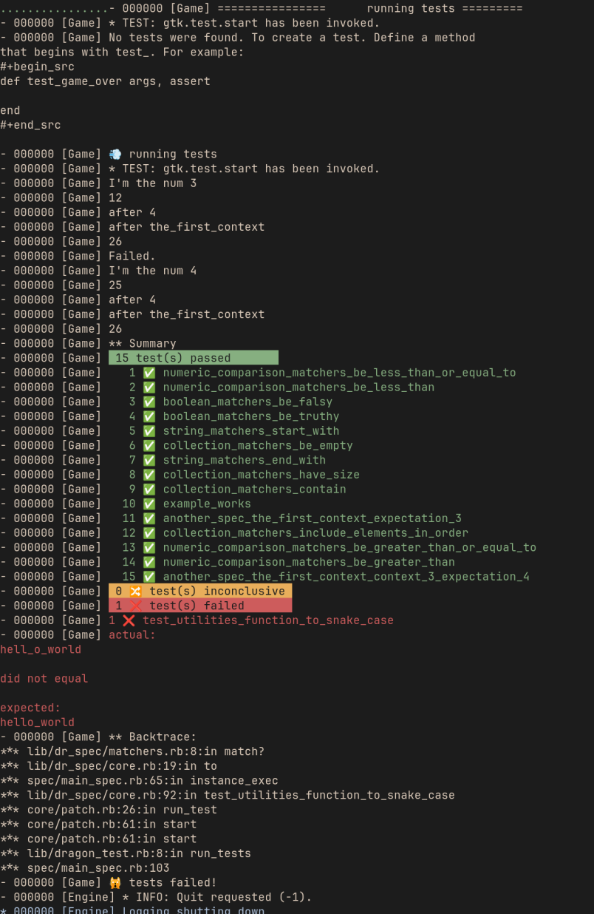

# Dr Spec

A simple DSL and test runner DragonRuby Game Toolkit (DRGTK).
It try to mimic rspec.

[New to writing tests? Check out this tutorial introducing the concept in DRGTK!](https://www.dragonriders.community/recipes/testing)

🚧 **dr_spec is a work in progress! It works, but the interfaces may change.** 🚧

## dr_spec 2.0 — Transition Branch

The `dr_spec_2` branch is the **active development branch** for the next major version of dr_spec. It contains a full rewrite to a class-based architecture (replacing the previous closure-based approach) that fixes long-standing scope isolation issues.

### What's changing

- **Class-based architecture**: 2-pass system (Build → Run) with `World`, `ExampleGroup`, `Example`, `ExampleContext`
- **Proper test isolation**: Each test runs in its own fresh `ExampleContext` — no more shared state leaking between tests
- **Scope bug fix**: Resolves [#53](https://github.com/levaleureux/dr_spec/issues/53)

### Branch workflow during transition

```
feature/* ──→ dr_spec_2 ──→ develop ──→ master
              (staging)     (after community testing)
```

All new features and fixes target `dr_spec_2`. Once the community has validated the new architecture, `dr_spec_2` will be merged into `develop`, then released to `master`.

**Want to help test?** Check out the `dr_spec_2` branch and run the specs against your project. Feedback welcome via [issues](https://github.com/levaleureux/dr_spec/issues).

## Install

### Manually

1. copy `lib/dr_spec` folder into your dragon ruby project.
2. on your `app/main.rb` or `app/test.rb` file add `require "lib/dr_spec/dragon_specs.rb"` at the bottom of the file.

That's it! Now you can write specs for your app using `dr_spec`.

### Using `smaug`

If you're using `smaug` to manage dependencies, you can install `dr_spec` by adding it to your `Smaug.toml`:

```toml
dr_spec = { repo = "https://github.com/levaleureux/dr_spec" }
```

Then simply run `smaug install` and add `require "smaug/dr_spec/lib/dr_spec/dragon_specs`
to your `app/main.rb` or `app/test.rb` file.

## Setup

Setting up and running your specs is easy. After you followed the installation instruction above, you're ready to create
your specs entrypoint file. This is normally `app/main.rb` or `app/test.rb`, but you can also have it in the `spec` folder if you prefer to keep it separate from your app code.

```ruby
# spec/main.rb
require "lib/dr_spec/dragon_specs.rb" # or if you're using smaug: require 'smaug/dr_spec/lib/dr_spec/dragon_specs'

spec "Setup specs" do
  specify "works" do
    expect(true).to be_truthy
  end
end
```

## Running specs

### With manual install

If you have installed `dr_spec` manually into your dragonruby project, you should have the `dragonruby` executable in
the same project folder. To run the specs, simply run:

```bash
./dragonruby . --test spec/main.rb`
```

Remember to replace `spec/main.rb` if you chose a different spec's entrypoint file.

### With smaug

If you are using smaug, you can also use it to run specs:

```bash
smaug run --test spec/main.rb
```

## Usage

### Basic example

To describe your `spec` or `it` block you can use a :symbole or a "string" with any case or spaces.

```ruby
spec "Numeric Comparison matchers" do
  specify "be greater than" do |args, assert|
    expect(10).to be_greater_than 5
  end
  specify "be_greater_than_or_equal_to" do |args, assert|
    expect(10).to be_greater_than_or_equal_to 10
  end
  specify "be_less_than" do |args, assert|
    expect(5).to be_less_than 10
  end
  specify "be_less_than_or_equal_to" do |args, assert|
    expect(5).to be_less_than_or_equal_to 5
  end
end

# you can use symbol as spec and specify desc
#
spec :boolean_matchers do
  specify "be_truthy" do |args, assert|
    expect(true).to be_truthy
  end
  specify :be_falsy do |args, assert|
    expect(false).to be_falsy
  end
end

# You can use context before and after block
#
context "context_3" do
  before do
    @b = 5
  end
  specify "expectation_4" do |args, assert|
    puts "I'm the num 4"
    puts @a = @a * 5 + @b
    assert.equal! @a, 25, "nope 25"
  end
  after do |args, assert|
    @b = 6
    puts "after 4"
    @a = 4 * 5 + @b
    assert.equal! @a, 26, "nope 25"
  end
end

```

### Structure

1. spec
2. context
3. specify (replaces `it` for DR 6.x+ / Ruby 3.4 compatibility)
4. xspecify (pending, replaces `xit`)

> **Note:** `it` is a reserved keyword in Ruby 3.4+ (used by DragonRuby 6.x). Use `specify` instead. On older DR versions, `it` and `xit` are still available as aliases.

Like rspec. If you want to use this lib it's maybe because you already know
rspec. If you want more doc please open an issue ;)

## Matchers

dr_spec replicates commonly used RSpec matchers. All matchers support `to` and `not_to`, and accept an optional `fail_with:` parameter for custom error messages.

### Equality

| Matcher | Description |
|---------|-------------|
| `eq(expected)` | Verifies that two values are equal |

```ruby
expect(1 + 1).to eq 2
expect("foo").not_to eq "bar"
```

### Numeric Comparison

| Matcher | Description |
|---------|-------------|
| `be_greater_than(n)` | Verifies value > n |
| `be_greater_than_or_equal_to(n)` | Verifies value >= n |
| `be_less_than(n)` | Verifies value < n |
| `be_less_than_or_equal_to(n)` | Verifies value <= n |

```ruby
expect(10).to be_greater_than 5
expect(5).to be_less_than_or_equal_to 5
```

### Boolean

| Matcher | Description |
|---------|-------------|
| `be_truthy` | Verifies value is `true` |
| `be_falsy` | Verifies value is falsy (`false` or `nil`) |
| `be_nil` | Verifies value is `nil` |

```ruby
expect(true).to be_truthy
expect(nil).to be_nil
```

### Type

| Matcher | Description |
|---------|-------------|
| `be_instance_of(klass)` | Verifies exact class match |
| `be_kind_of(klass)` | Verifies class or ancestor match |

```ruby
expect("hello").to be_instance_of(String)
expect(1).to be_kind_of(Numeric)
```

### Collection

| Matcher | Description |
|---------|-------------|
| `include(element)` | Verifies collection includes element |
| `contain(element)` | Alias for `include` |
| `contain_exactly(array)` | Verifies collection has same elements (any order) |
| `include_elements_in_order(array)` | Verifies elements appear in order |
| `have_size(n)` | Verifies collection size |
| `be_empty` | Verifies collection is empty |

```ruby
expect([1, 2, 3]).to include 2
expect([3, 1, 2]).to contain_exactly [1, 2, 3]
expect([]).to be_empty
```

### String

| Matcher | Description |
|---------|-------------|
| `start_with(string)` | Verifies string starts with prefix |
| `end_with(string)` | Verifies string ends with suffix |
| `match(regex)` | Verifies string matches pattern |

```ruby
expect("hello world").to start_with "hello"
expect("hello world").to end_with "world"
```

### Error

| Matcher | Description |
|---------|-------------|
| `raise_error` | Verifies a block raises any error |
| `raise_error(ErrorClass)` | Verifies a block raises a specific error class |

```ruby
expect { raise "boom" }.to raise_error
expect { raise ArgumentError }.to raise_error(ArgumentError)
expect { 1 + 1 }.not_to raise_error
```

### Object

| Matcher | Description |
|---------|-------------|
| `respond_to(:method_name)` | Verifies object responds to a method |

```ruby
expect("hello").to respond_to(:length)
expect([1, 2]).to respond_to(:push)
```

### Custom

| Matcher | Description |
|---------|-------------|
| `satisfy { \|value\| ... }` | Verifies value satisfies a custom block |

```ruby
expect(10).to satisfy { |v| v > 5 }
expect(42).to satisfy { |v| v.even? && v > 10 }
```


## Outputs

There is on this project a will to make a very fast and readable output




## Improve de doc

If you want to help on the doc of this project.
you can use grip to preview your markdown.

```
  pip install grip

```

```
  grip chemin/vers/votre/fichier.md

```
## Contributors

thanks to 
1. https://github.com/ekiru for the first PR.
1. https://github.com/terrainoob  for opening some issue.

## Thanks

This project was strongly inspired by
https://github.com/DragonRidersUnite/dragon_test

See
https://github.com/kfischer-okarin/roguelike-tutorial-2021/tree/main/game/tests
and
https://github.com/kfischer-okarin/sludge-n-cinder/tree/main/game/tests
for good complement

This project is pretty new, so if you want to improve the doc or add other test
helper. Feel free to open an issue and make a PR it will be apreciate.

